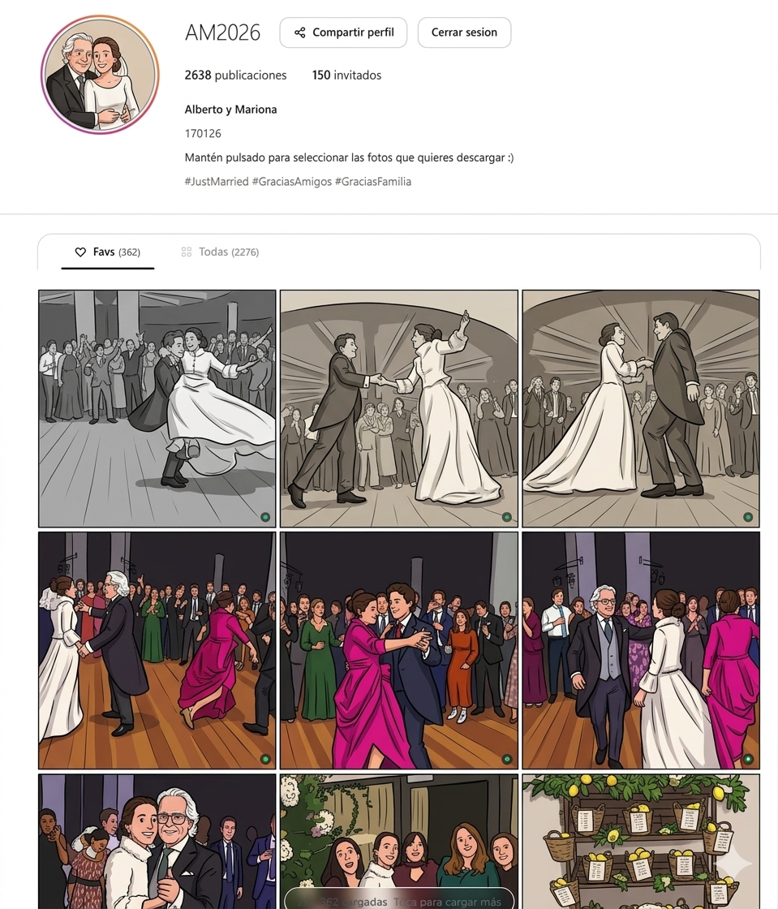

# Aran Media Uploader

Galeria privada para compartir fotos y videos con Firebase Storage.

## Requisitos

- Node.js
- Un proyecto de Firebase con Authentication, Firestore y Storage activos

## Configuracion de Firebase Authentication

1. En Firebase Console, activa Authentication.
2. Habilita el proveedor Anonymous.
3. Anade los dominios desde los que vayas a abrir la app en Authorized domains.
4. Publica las reglas de Storage de este repositorio para exigir usuario autenticado.

## Configuracion de Firestore

1. Crea una coleccion `config`.
2. Anade al menos un documento con el campo string `MasterPass`.
3. Permite la lectura de esa coleccion desde la app para que el login pueda validar la clave antes de abrir la sesion anonima.

## Desarrollo local

1. Instala dependencias con `npm install`.
2. Arranca la app con `npm run dev`.
3. Entra con la clave compartida guardada en Firestore en `config.MasterPass` para acceder a la galeria.

## CORS de Storage

Las descargas en lote en ZIP necesitan leer los archivos desde el navegador. Para que eso funcione en local y en despliegue, aplica la politica CORS de `cors.json` al bucket de Firebase Storage.

1. Asegurate de tener Google Cloud SDK instalado y autenticado.
2. Ejecuta `gsutil cors set cors.json gs://yourbucket-id.firebasestorage.app`.
3. Verifica el resultado con `gsutil cors get gs://yourbucket-id.firebasestorage.app`.

Si cambias el puerto local de desarrollo, anadelo tambien al array `origin` dentro de `cors.json`.
